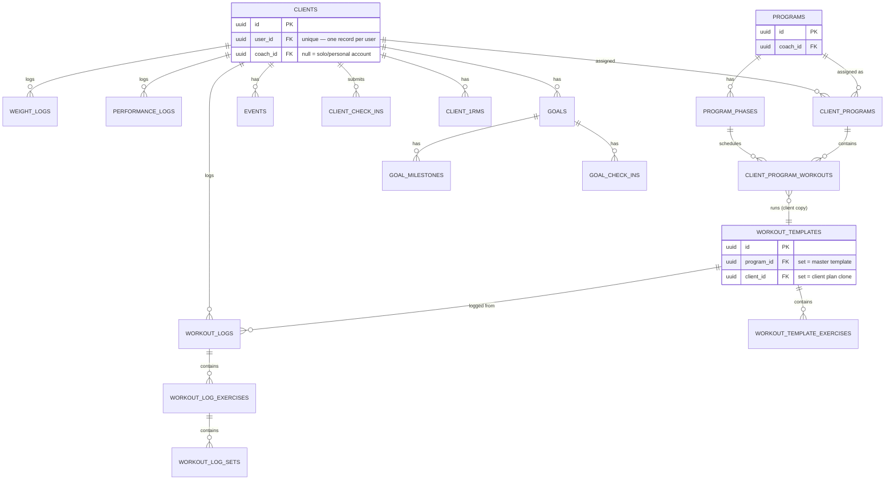
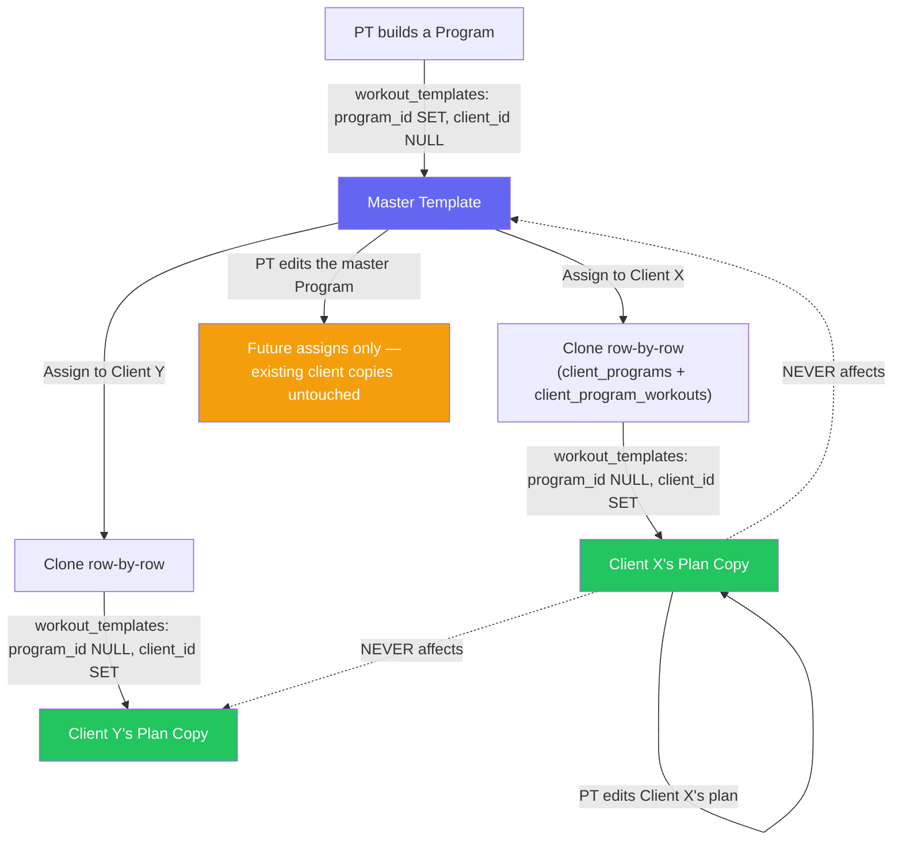
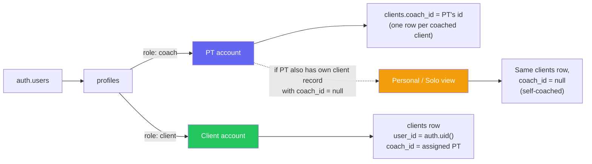
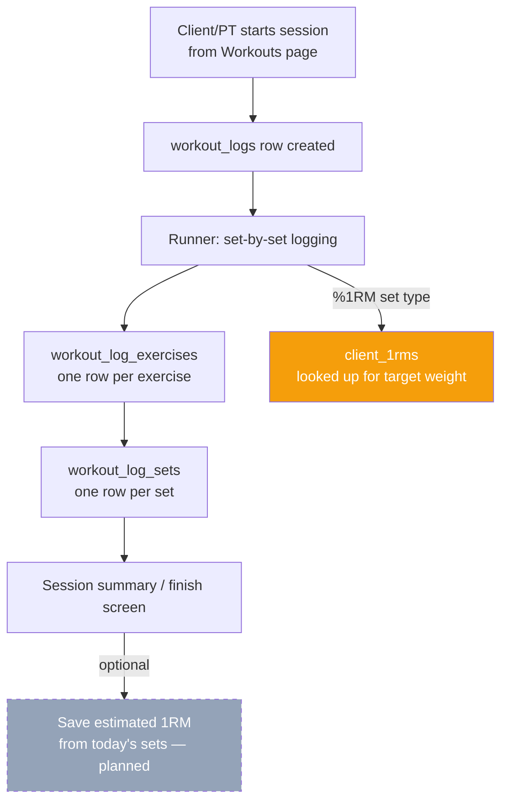

# CoachApp — Data Model

_Living design doc. Update whenever the schema changes — keep in sync with [[project-coachapp-architecture]] and CRITICAL.md. Mermaid renders directly on GitHub and most markdown viewers — no external tool needed._

---

## Core entity relationships

---

## The two-level editing model (the part that matters most)

This is the single highest-risk area in the schema — getting it wrong means one client's edit silently changes another client's plan, or vice versa. See [[project-coachapp-architecture]] for the full rule.

**Rule:** `program_id` set + `client_id` null = master. `program_id` null + `client_id` set = personal copy. Never both set, never both null for a real template (standalone templates are both null). No auto-renaming — template names only change manually, which is what lets "apply to all sessions named X" work reliably.

---

## Account types / roles

**Key facts:**
- `clients.user_id` has a unique constraint — exactly one client record per user, ever.
- Solo/Personal is **not** a separate record — it's the same client record with `coach_id` nulled.
- `window._masterAccount` = true when the logged-in coach also has any client record (coached or personal).
- RLS anchor for solo: `client_id in (select id from clients where user_id = auth.uid() and coach_id is null)`.

---

## Workout logging flow (runner)

The dashed box is the 1RM system work planned for this session — not built yet.

---

## How to keep this in sync

- Any schema change (new table, new FK, renamed column) → update this file in the same session.
- This file lives in the Vault, not the repo — it's the design reference, not enforced by code. The source of truth for actual constraints is Supabase itself (`information_schema`) and `CRITICAL.md`.
- Don't duplicate this in Notion or any other tool — one file, versioned with the rest of the Vault.
