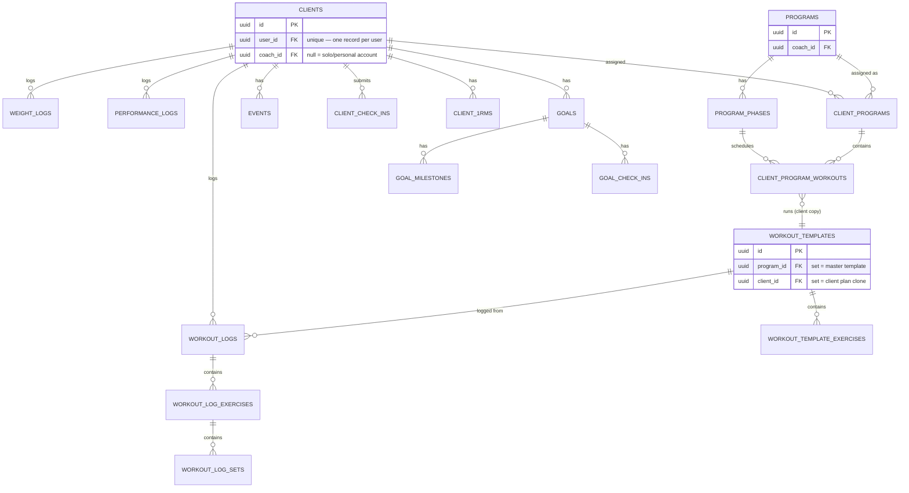
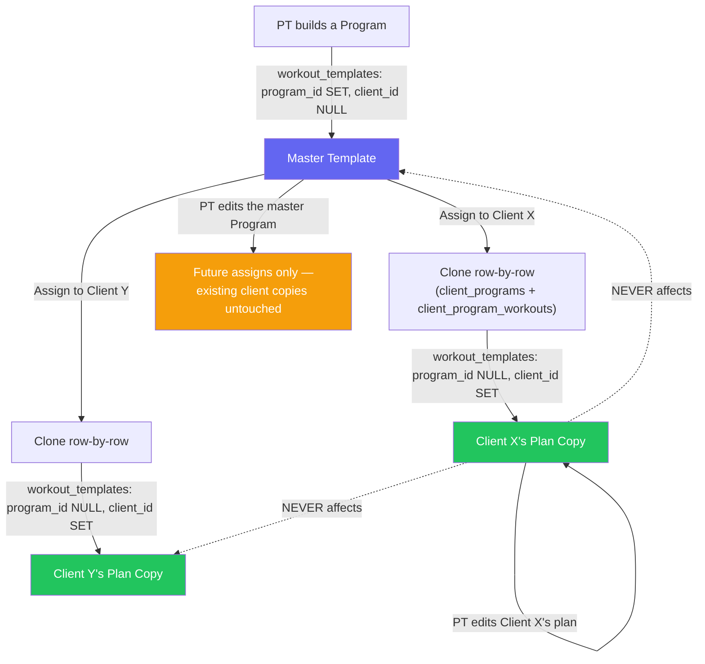
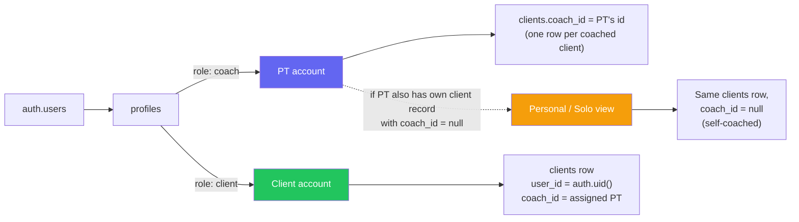
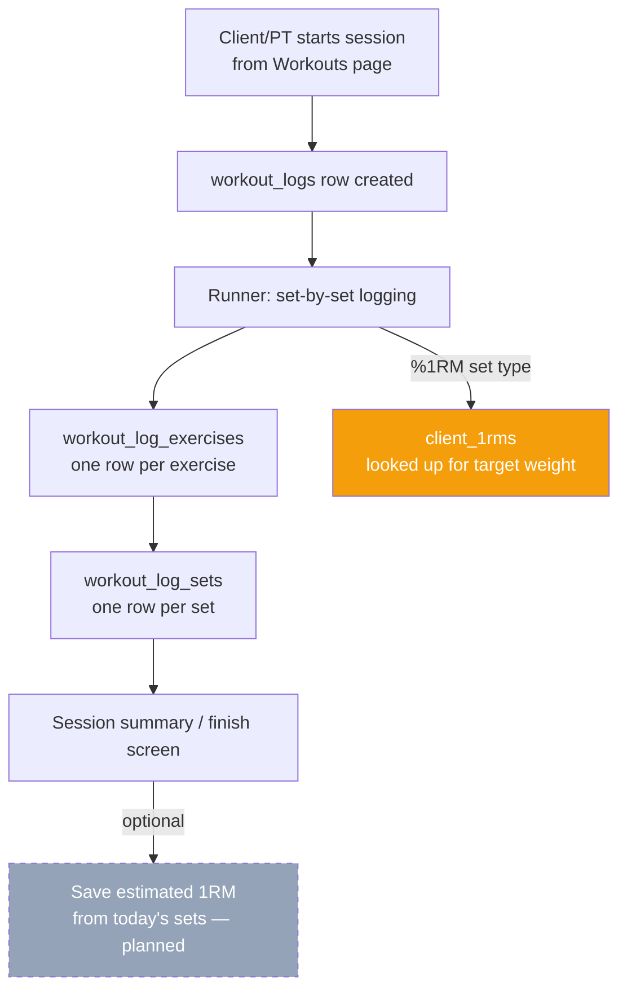

# CoachApp — Data Model

_Living design doc. Update whenever the schema changes — keep in sync with [[project-coachapp-architecture]] and CRITICAL.md. Mermaid renders directly on GitHub and most markdown viewers — no external tool needed._

---

## Core entity relationships

```mermaid
erDiagram
    CLIENTS ||--o{ WEIGHT_LOGS : logs
    CLIENTS ||--o{ PERFORMANCE_LOGS : logs
    CLIENTS ||--o{ WORKOUT_LOGS : logs
    CLIENTS ||--o{ GOALS : has
    CLIENTS ||--o{ EVENTS : has
    CLIENTS ||--o{ CLIENT_CHECK_INS : submits
    CLIENTS ||--o{ CLIENT_1RMS : has
    CLIENTS ||--o{ CLIENT_PROGRAMS : assigned

    PROGRAMS ||--o{ PROGRAM_PHASES : has
    PROGRAMS ||--o{ CLIENT_PROGRAMS : "assigned as"
    PROGRAM_PHASES ||--o{ CLIENT_PROGRAM_WORKOUTS : schedules

    CLIENT_PROGRAMS ||--o{ CLIENT_PROGRAM_WORKOUTS : contains
    CLIENT_PROGRAM_WORKOUTS }o--|| WORKOUT_TEMPLATES : "runs (client copy)"

    WORKOUT_TEMPLATES ||--o{ WORKOUT_TEMPLATE_EXERCISES : contains
    WORKOUT_TEMPLATES ||--o{ WORKOUT_LOGS : "logged from"

    WORKOUT_LOGS ||--o{ WORKOUT_LOG_EXERCISES : contains
    WORKOUT_LOG_EXERCISES ||--o{ WORKOUT_LOG_SETS : contains

    GOALS ||--o{ GOAL_MILESTONES : has
    GOALS ||--o{ GOAL_CHECK_INS : has

    CLIENTS {
        uuid id PK
        uuid user_id FK "unique — one record per user"
        uuid coach_id FK "null = solo/personal account"
    }
    PROGRAMS {
        uuid id PK
        uuid coach_id FK
    }
    WORKOUT_TEMPLATES {
        uuid id PK
        uuid program_id FK "set = master template"
        uuid client_id FK "set = client plan clone"
    }
```

---

## The two-level editing model (the part that matters most)

This is the single highest-risk area in the schema — getting it wrong means one client's edit silently changes another client's plan, or vice versa. See [[project-coachapp-architecture]] for the full rule.

```mermaid
flowchart TD
    A[PT builds a Program] -->|workout_templates: program_id SET, client_id NULL| B[Master Template]
    B -->|Assign to Client X| C["Clone row-by-row\n(client_programs + client_program_workouts)"]
    C -->|workout_templates: program_id NULL, client_id SET| D[Client X's Plan Copy]
    B -->|Assign to Client Y| E["Clone row-by-row"]
    E -->|workout_templates: program_id NULL, client_id SET| F[Client Y's Plan Copy]

    D -->|PT edits Client X's plan| D
    D -.->|"NEVER affects"| F
    D -.->|"NEVER affects"| B

    B -->|PT edits the master Program| G["Future assigns only —\nexisting client copies untouched"]

    style B fill:#6366f1,color:#fff
    style D fill:#22c55e,color:#fff
    style F fill:#22c55e,color:#fff
    style G fill:#f59e0b,color:#fff
```

**Rule:** `program_id` set + `client_id` null = master. `program_id` null + `client_id` set = personal copy. Never both set, never both null for a real template (standalone templates are both null). No auto-renaming — template names only change manually, which is what lets "apply to all sessions named X" work reliably.

---

## Account types / roles

```mermaid
flowchart LR
    U[auth.users] --> P[profiles]
    P -->|role: coach| PT[PT account]
    PT --> CL1["clients.coach_id = PT's id\n(one row per coached client)"]
    PT -.->|"if PT also has own client record\nwith coach_id = null"| SOLO[Personal / Solo view]

    P -->|role: client| CLV[Client account]
    CLV --> CR["clients row\nuser_id = auth.uid()\ncoach_id = assigned PT"]

    SOLO --> SR["Same clients row,\ncoach_id = null\n(self-coached)"]

    style PT fill:#6366f1,color:#fff
    style CLV fill:#22c55e,color:#fff
    style SOLO fill:#f59e0b,color:#fff
```

**Key facts:**
- `clients.user_id` has a unique constraint — exactly one client record per user, ever.
- Solo/Personal is **not** a separate record — it's the same client record with `coach_id` nulled.
- `window._masterAccount` = true when the logged-in coach also has any client record (coached or personal).
- RLS anchor for solo: `client_id in (select id from clients where user_id = auth.uid() and coach_id is null)`.

---

## Workout logging flow (runner)

```mermaid
flowchart TD
    A[Client/PT starts session\nfrom Workouts page] --> B[workout_logs row created]
    B --> C[Runner: set-by-set logging]
    C --> D[workout_log_exercises\none row per exercise]
    D --> E[workout_log_sets\none row per set]
    C -->|"%1RM set type"| F[client_1rms\nlooked up for target weight]
    E --> G[Session summary / finish screen]
    G -->|optional| H[Save estimated 1RM\nfrom today's sets — planned]

    style F fill:#f59e0b,color:#fff
    style H fill:#94a3b8,color:#fff,stroke-dasharray: 5 5
```

The dashed box is the 1RM system work planned for this session — not built yet.

---

## Schema changes 2026-07-12 → 2026-08-24 (reconciled 2026-08-23/24, OS v3)

This file had not been written since 2026-06-30 while **16 migrations** landed, so it described
a schema that no longer existed. Reconciled by reading `scripts/*.sql` directly.

**`profiles`** — the account-shape columns, none of which existed above:

| column | added | notes |
|---|---|---|
| `starter_seeded` | 2026-07-12 | bool, default false — gates the new-coach first-login seed |
| `solo_only` | 2026-07-24 | bool, default false — locks an account to personal-only, no coach dashboard |
| `weight_unit` | 2026-07-24 | `kg`/`lb`, default kg |
| `jump_height_unit` | 2026-07-24 | `cm`/`in`, default cm |
| `cardio_distance_unit` | 2026-07-24 | `km`/`mi`, default km |
| `profiles_role_chk` | 2026-08-01 | CHECK constraint pinning the role enum (solo migration) |
| `consented_at` | 2026-08-24 | timestamptz, nullable. When this user affirmatively accepted the privacy policy. **NULL = no consent on record.** |
| `consent_policy_version` | 2026-08-24 | text, nullable. Which `privacy-policy.html` version they accepted (its "Last updated" date). |

> **Consent is two columns, not one, and never back-filled.** A timestamp alone cannot tell you WHAT
> was agreed to: editing the policy would silently re-interpret an old consent as covering wording the
> person never saw. The version must match `PRIVACY_POLICY_VERSION` in `js/app-core.js` and the
> "Last updated" date in `privacy-policy.html` — bump all three together and expect to re-take consent.
> Written by the invite-acceptance handler in `js/app-progress.js`, which asserts on the returned row:
> a policy-refused upsert comes back `{ data: [], error: null }`, and an activated account with no
> consent row is the exact compliance gap the column exists to close.
>
> **Read-side gate (`showApp` in `js/app-core.js`).** The invite checkbox only covers one of three
> routes to an active account; the gate blocks the app for ANY role whose `consented_at` is null or
> whose stored version is not the current `PRIVACY_POLICY_VERSION`. Its consent read is a **separate
> query that fails open** — folding these columns into `loadUserInfo`'s select would error before the
> migration, null `currentProfile`, and trip `showApp`'s fail-closed branch, locking every user out.
>
> **The three E2E fixture accounts (`auth.users.email like 'coachapp.e2e%'`) carry a stamped consent**
> (`2026-08-24`, version `2026-06-29`) so the suite is not blocked by the gate. They are fixtures, not
> data subjects. Applied 2026-08-24 and verified by SELECT — all three rows present with timestamps.
> Real accounts are never stamped; as of that date 4 of the 7 auth users are real and all 4 will meet
> the gate on their next login. `profiles` RLS is two policies — "Own profile" (`ALL`, qual
> `auth.uid() = id`, `with_check` NULL) and "User updates own profile" (`UPDATE`) — so the ALL policy's
> qual is reused for writes. Safe here **only because that qual has no `OR`**; see sql-safety §8.

> **Unit preference is a DATA DIMENSION, not a display detail.** These three columns are per-metric
> and account-wide. Canonical storage stays kg/cm/km; only render converts. See
> `feedback-unit-preference-is-a-test-dimension` — a whole suite running in kg made an lb-only crash
> invisible to 428 tests.

**`workout_log_sets`** — the cardio/interval metric columns:

| column | added | notes |
|---|---|---|
| `avg_hr`, `max_hr` | 2026-07-18 | smallint |
| `avg_watts` | 2026-07-22 | smallint |
| `phase` | 2026-07-25 | text — interval phase label |
| `pace_500m_secs` | 2026-08-08 | smallint + CHECK `wls_pace_500m_secs_chk` |
| `stroke_rate_spm` | 2026-08-08 | smallint + CHECK `wls_stroke_rate_spm_chk` |

**`metric_type`** — added 2026-07-18 to `workout_template_exercises` (text, not null, default
`weight_reps`), with matching CHECK constraints on `exercises`, `workout_template_exercises` and
`workout_log_exercises` (2026-07-25). Cardio was merged INTO interval on 2026-08-09
(`merge-cardio-into-interval-2026-08-09.sql`, which kept a `_cardio_merge_backup_` table).

**Other:**

- `weight_logs.resting_hr` — smallint + CHECK, 2026-07-19.
- `workout_templates.family_id` — uuid, 2026-08-14. Groups a template with its clones.
- **Program blocks** — new table, 2026-08-15 (`add-program-blocks-2026-08-15.sql`).
- RLS/policy migrations that changed no columns: `fix-storage-rls-2026-07-12.sql` (the
  cross-tenant photo leak — see CRITICAL.md), `fix-workout-logs-insert-policy-2026-07-30.sql`.

---

## How to keep this in sync

- Any schema change (new table, new FK, renamed column) → update this file in the same session.
- This file lives in the Vault, not the repo — it's the design reference, not enforced by code. The source of truth for actual constraints is Supabase itself (`information_schema`) and `CRITICAL.md`.
- Don't duplicate this in Notion or any other tool — one file, versioned with the rest of the Vault.
- **Enforced since 2026-08-23:** `os-lint`'s `doc-obligations` check goes RED when any `scripts/*.sql` is newer than this file. The rule above was prose for 54 days and was missed 16 times; it now has a trigger. RULE 0 for documents.
